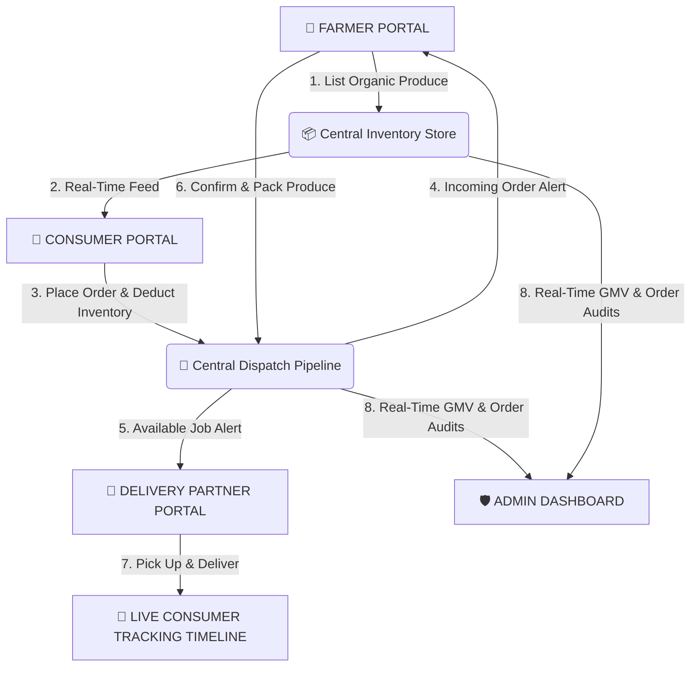

# 🌾 FarmDirect — Vayal 2 Veedu (வயல் 2 வீடு)

<div align="center">


### **"Direct from the Farmer's Field (வயல்) to Your Home (வீடு)"**

*A Production-Grade, Cross-Platform Digital Agriculture Marketplace connecting Farmers, Consumers, Delivery Partners, and Platform Administrators in Real-Time.*

</div>

---

## 📖 Table of Contents
- [📌 Project Overview](#-project-overview)
- [📊 App Review Presentation & Visual Showcase](#-app-review-presentation--visual-showcase)
- [🚀 What's New in Version 2.2](#-whats-new-in-version-22)
- [🌟 What's New in Version 2.1](#-whats-new-in-version-21)
- [✨ Features in Version 2.0](#-features-in-version-20)
- [⚡ Multi-Role Matrix & Demo Credentials](#-multi-role-matrix--demo-credentials)
- [📐 System Architecture & Order Pipeline](#-system-architecture--order-pipeline)
- [🎨 Design System & UI Highlights](#-design-system--ui-highlights)
- [🛠️ Technology Stack](#️-technology-stack)
- [🚀 Quick Start & Installation](#-quick-start--installation)
- [👥 GitHub Team Workflow](#-github-team-workflow)
- [🗄️ Database Schema](#️-database-schema)
- [🎓 Course Information](#-course-information)

---

## 📌 Project Overview

**FarmDirect (Vayal 2 Veedu / வயல் 2 வீடு)** is an end-to-end mobile and backend platform engineered to eliminate multi-tiered agricultural intermediaries. By connecting growers directly with households, the platform ensures:

- 🌾 **For Farmers:** Fair pricing, 100% direct revenue retention, automated order status pipelines, and reason-based order cancellation control.
- 🛒 **For Consumers:** Fresh, pesticide-free, traceable farm produce at fair market prices with farm origin attribution and multi-order live dispatch tracking.
- 🛵 **For Delivery Partners:** Real-time job dispatches, interactive job detail inspection, customer/farm contact shortcuts, and route coordinates.
- 🛡️ **For Administrators:** Platform-wide GMV analytics, verified farmer/rider moderation, and full transaction oversight with protected credentials.

---

## 📊 App Review Presentation & Visual Showcase

> [!TIP]
> **Complete App Review Assets Available for Demonstration**

- 🖥️ **Interactive Web Presentation Slide Deck:** Open [`presentation_slides.html`](presentation_slides.html) directly in any web browser to present interactive slides with a click-to-zoom Lightbox modal and keyboard navigation.
- 📊 **Native Widescreen PowerPoint Presentation:** Download [`Vayal_2_Veedu_App_Review.pptx`](Vayal_2_Veedu_App_Review.pptx) (16:9 9-slide deck with all 23 high-resolution app screenshots and module summaries).

### 📱 Visual Highlights Across Portals

| Portal / Module | High-Resolution App Preview | Key Operational Highlight |
| :--- | :---: | :--- |
| **Portal Switcher & Auth** |  | Single-tap entrance portal to toggle seamlessly between Farmer, Consumer, Rider, and Admin views |
| **Farmer Operations** |  | Real-time GMV revenue tracking, direct produce listing, and reason-based order rejection controls |
| **Consumer Marketplace** |  | HD produce catalog, live 5% GST itemization, farm origin attribution, and 5-step dispatch tracking |
| **Delivery Logistics** |  | Interactive bottom-sheet job inspector, farm/customer contact shortcuts, and pickup/delivery toggles |
| **Admin Governance** |  | Platform-wide GMV metrics, farmer land verification, fleet moderation, and single-admin security |

---

## 🚀 What's New in Version 2.2

> [!IMPORTANT]
> **Version 2.2 Major Release & Presentation Suite**

### 📊 1. Native Widescreen PowerPoint Presentation (`Vayal_2_Veedu_App_Review.pptx`)
- Built a native 16:9 9-slide PowerPoint deck featuring all 23 high-resolution app screenshots paired with concise operational summaries for evaluators.

### 🖥️ 2. Interactive Web Presentation Slide Deck (`presentation_slides.html`)
- Integrated a standalone, interactive HTML slideshow equipped with a click-to-zoom Lightbox modal (click any screenshot to inspect fine details) and keyboard arrow navigation.

### 🖼️ 3. Complete 23 High-Resolution Screenshots Audit
- Organized and verified 100% screenshot coverage across all 4 user roles (*Different Users Login*, *Role Profiles*, *Farmer Operations*, *Consumer Marketplace & Tracking*, *Delivery Logistics*, *Admin Governance*).

### 🛠️ 4. Layout Stability & Zero-Overflow Assurance
- Resolved layout flex-fit issues in modal dialogs (`delivery_dashboard_screen.dart`, `farmer_dashboard_screen.dart`), achieving 100% test pass rate on Flutter unit & widget test suites (`7/7 tests passed`).

---

## 🌟 What's New in Version 2.1

> [!IMPORTANT]
> **Version 2.1 Major Release & Usability Upgrade**

### 📱 1. Standardized App Branding Header (`AppStandardHeader`)
- Integrated a uniform top navigation app bar featuring the official circular `app_logo_icon.png` logo, the app title **Vayal 2 Veedu**, and context-aware role subtitles (*Consumer Direct Marketplace*, *Farmer Direct Portal*, *Delivery Fleet Portal*, *Platform Administrator*, *Order Tracking & History*).

### 👤 2. Professional & Role-Specific Editable Profiles
- Upgraded `AuthProvider` and `ProfileScreen` with bottom-sheet editing for all 4 user roles:
  - **Farmers:** Farm Name, Location/District, Land Area (Acres), Primary Produce, FSSAI License No, Payout UPI.
  - **Consumers:** Delivery Address, Landmark, Alternate Contact Phone, Delivery Time Preferences.
  - **Delivery Partners:** Vehicle Type, Vehicle Reg No, Driving License No, Service Zone, Emergency Contact.
  - **Platform Administrator:** Admin Title/Designation, Department Division, Clearance Level, Audit Clearance.

### 🛡️ 3. Platform Administrator Credential Enforcement & Security
- Updated Administrator credentials to `tharunpranavt@vayal2veedu.com` / `TPadmin@V2V`.
- Hidden the *"Register Now"* link on the Platform Administrator login portal to enforce a strict single-admin policy.

### 🌾 4. Farmer Order Cancellation & Rejection Workflow
- Added an interactive **Reject Order** option alongside **Accept Order** for Farmers.
- Includes a cancellation reason selection dialog (*Harvest Shortfall*, *Weather Damage*, *Logistics Unavailable*, or *Custom Reason*) and displays a red warning banner across Farmer, Consumer, and Delivery views.

### 📍 5. Farm & Farmer Origin Attribution
- Embedded Farm Name and Farmer contact details into order models, displaying farm origin on Consumer Order Tracking screens and Delivery Partner Job Detail modals.

### 🖼️ 6. Produce Visual Asset Rectification & Layout Stability
- Replaced broken produce images (e.g. Crisp Sweet Carrots) with crisp Unsplash produce photos.
- Resolved all `RenderFlex` layout overflow exceptions across varying screen widths.

---

## ✨ Features in Version 2.0

> [!TIP]
> **Base Version 2.0 Features**

### 📱 1. Multi-Order Live Tracking (`/consumer/orders/track`)
- Consumers can view and track **all placed orders** sequentially with a live 5-step animated progress timeline.

### 🛵 2. Interactive Delivery Job Detail Inspector
- Delivery partners can launch a bottom-sheet modal with farm pickup address, customer dropoff location, itemized produce breakdown, and 1-tap **Call Farm** & **Call Customer** actions.

### 🌾 3. Sequential Farmer Order Pipeline
- Farmers transition incoming orders step-by-step (`1. Confirm Order` ➔ `2. Start Packing` ➔ `3. Ready for Pickup`).

---

## ⚡ Multi-Role Matrix & Demo Credentials

| Role | Symbol | Portal Route | Pre-filled Email | Password | Key Functionalities |
| :--- | :---: | :--- | :--- | :--- | :--- |
| **Farmer** | 🌾 | `/farmer/dashboard` | `farmer@vayal2veedu.com` | `Password123!` | • Publish & edit produce listings with pricing & stock<br>• Realtime revenue metrics (GMV & Active Produce)<br>• Order acceptance & rejection workflow |
| **Consumer** | 🛒 | `/consumer/home` | `consumer@vayal2veedu.com` | `Password123!` | • Organic produce catalog with category filters<br>• Dynamic shopping cart with live GST (5%) & delivery calculation<br>• Live multi-order tracking & farm origin attribution |
| **Delivery Partner** | 🛵 | `/delivery/dashboard` | `delivery@vayal2veedu.com` | `Password123!` | • Available dispatch jobs queue<br>• Interactive job details modal with farm & customer contact buttons<br>• Milestone status toggles (`Pick Up` ➔ `Deliver`) |
| **Administrator** | 🛡️ | `/admin/dashboard` | `tharunpranavt@vayal2veedu.com` | `TPadmin@V2V` | • System-wide GMV & order volume analytics<br>• Single-admin credential restriction & RBAC moderation<br>• Live transaction oversight & dispatch inspection |

---

## 📐 System Architecture & Order Pipeline



---

## 🎨 Design System & UI Highlights

The application adopts Google's **Material 3** design system customized with the **Vayal 2 Veedu** agricultural identity:

- 🟢 **Agricultural Green (`#1E5631`):** Represents fresh fields, organic produce, and trust.
- 📙 **Fresh Harvest Orange (`#F9690E`):** Highlights call-to-actions, cart badges, and active alerts.
- 🔵 **Info Blue (`#0288D1`):** Accents delivery dispatch statuses and interactive modals.
- ⚪ **Warm Surface (`#FAFAFA`):** Provides high readability contrast for mobile screens.
- 🔤 **Typography:** Google Fonts (`Outfit` for headlines, `Inter` for clean body typography).

---

## 🛠️ Technology Stack

### **Mobile Frontend (Flutter)**
- **Framework:** Flutter 3.x / Dart 3.x
- **State Management:** Riverpod 2.x (`StateNotifierProvider`, `ProviderScope`)
- **Navigation:** `go_router` 13.x with declarative role guards
- **HTTP Client:** Dio 5.x with JSON serializable models
- **Typography & Icons:** Google Fonts & Cupertino Icons

### **Backend Service (NestJS)**
- **Framework:** NestJS 10.x (TypeScript / Node.js)
- **Database ORM:** PostgreSQL 16 + Prisma ORM
- **API Specification:** Swagger OpenAPI (`/api/docs`)
- **Realtime Gateway:** Socket.IO WebSocket Gateway
- **Security:** JWT authentication, RBAC Guards, bcrypt hashing, Helmet, CORS

---

## 🚀 Quick Start & Installation

### 1. Prerequisites
- **Flutter SDK:** v3.19+ ([Download Flutter](https://flutter.dev))
- **Node.js:** v18+ ([Download Node.js](https://nodejs.org))
- **Android Studio** with Android SDK 35 & Pixel 6 AVD Emulator

---

### 2. Running the Flutter Mobile App

```bash
# Clone the repository
git clone https://github.com/TharunPranav2007/Vayal-2-Veedu-Mobile-App-.git
cd Vayal-2-Veedu-Mobile-App-

# Install Flutter dependencies
flutter pub get

# Run unit and widget tests
flutter test

# Launch on connected Android Emulator (Pixel 6)
flutter run -d emulator-5554
```

---

### 3. Running the NestJS Backend Service

```bash
# Navigate to backend directory
cd backend

# Install Node dependencies
npm install

# Set up environment configuration
cp .env.example .env

# Run database migrations and generate Prisma client
npx prisma generate
npx prisma migrate dev

# Start NestJS dev server
npm run start:dev
```
- **REST API Base URL:** `http://localhost:3000/api`
- **Swagger Documentation:** [http://localhost:3000/api/docs](http://localhost:3000/api/docs)

---

## 👥 GitHub Team Workflow

### 1. Pushing Local Changes
```bash
# Stage changed files
git add .

# Commit with a descriptive message
git commit -m "feat(mobile): add delivery job detail modal and multi-order tracking"

# Push to main branch
git push origin main
```

### 2. Pulling Latest Changes
```bash
# Always pull before starting daily work
git pull origin main
```

---

## 🗄️ Database Schema

The PostgreSQL database models 20 core relational entities:
- `users`, `farmer_profiles`, `consumer_profiles`, `delivery_profiles`
- `categories`, `products`, `product_images`
- `carts`, `cart_items`, `orders`, `order_items`, `deliveries`
- `reviews`, `wishlists`, `notifications`, `addresses`

---

## 🎓 Course Information

- **Course:** U21CS503 – Mobile Application Development
- **Application Name:** FarmDirect ("Vayal 2 Veedu" / "வயல் 2 வீடு")
- **Repository:** [`TharunPranav2007/Vayal-2-Veedu-Mobile-App-`](https://github.com/TharunPranav2007/Vayal-2-Veedu-Mobile-App-)
- **License:** MIT License
