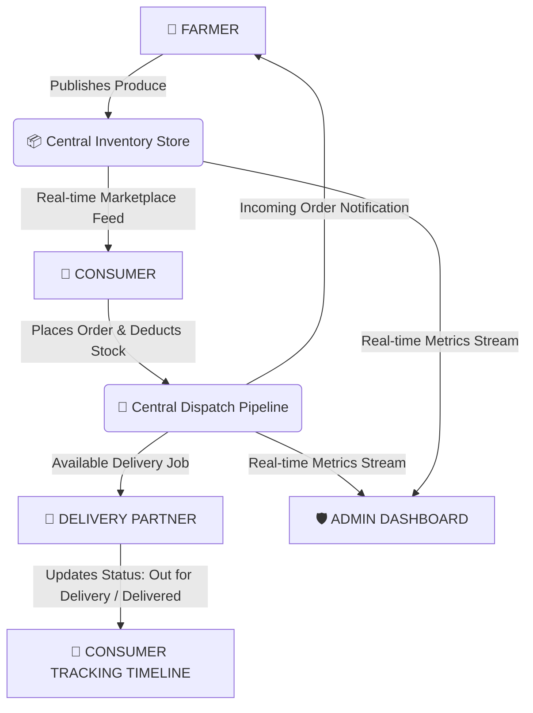

# 🌾 FarmDirect — Vayal 2 Veedu (വയൽ 2 വീട്)

<div align="center">


**"Direct from the Farmer's Field (Vayal) to Your Home (Veedu)"**

*A Production-Grade, Cross-Platform Digital Agriculture Marketplace connecting Farmers, Consumers, Delivery Partners, and Platform Administrators in Real-Time.*

</div>

---

## 📖 Table of Contents
- [📌 Project Overview](#-project-overview)
- [⚡ Key Features & Multi-Role Sync](#-key-features--multi-role-sync)
- [📐 System Architecture & Order Lifecycle](#-system-architecture--order-lifecycle)
- [🎨 UI & Design System](#-ui--design-system)
- [🛠️ Technology Stack](#️-technology-stack)
- [🚀 Quick Start & Installation](#-quick-start--installation)
- [👥 Team Collaboration & GitHub Workflow](#-team-collaboration--github-workflow)
- [🗄️ Database Schema](#️-database-schema)
- [🎓 Course Information](#-course-information)

---

## 📌 Project Overview

**FarmDirect (Vayal 2 Veedu)** is an end-to-end digital marketplace engineered to eliminate traditional multi-tiered agricultural intermediaries. By connecting growers directly with households, the platform ensures:
- **For Farmers:** Fair pricing, 100% direct revenue retention, and automated order management.
- **For Consumers:** Fresh, pesticide-free, traceable farm produce at fair market prices.
- **For Delivery Partners:** Real-time job dispatches with optimized route coordinates.
- **For Administrators:** System-wide transaction oversight, user verification, and catalog moderation.

---

## ⚡ Key Features & Multi-Role Sync

| Role | Symbol | Core Features & Functionality |
| :--- | :---: | :--- |
| **Farmer** | 🌾 | • Add & edit produce listings with custom pricing, units & stock<br>• Realtime business analytics (Total Revenue, Active Produce count)<br>• Incoming order dispatch queue with 1-tap order acceptance |
| **Consumer** | 🛒 | • Interactive produce catalog with search & category filtering (`Vegetables`, `Greens`, `Fruits`, `Grains`)<br>• Dynamic shopping cart with live GST (5%) & delivery calculation<br>• Real-time animated order fulfillment timeline |
| **Delivery Partner** | 🛵 | • Available job dispatch queue with farm pickup & house dropoff coordinates<br>• Live milestone status toggles (`Pick Up & Start` ➔ `Mark Delivered`)<br>• Daily completion counter & earnings summary |
| **Administrator** | 🛡️ | • Platform-wide GMV & order metrics dashboard<br>• Farmer account verification & product catalog moderation<br>• Real-time system health oversight |

---

## 📐 System Architecture & Order Lifecycle



### 🔄 Multi-Role Realtime Sync Flow:
1. **Listing Creation:** A Farmer lists produce ➔ Immediately visible on Consumer Home.
2. **Order Placement:** A Consumer checks out ➔ Inventory stock decrements ➔ Order dispatches to Farmer & Delivery Partner dashboards.
3. **Fulfillment:** Delivery Partner marks *"Out for Delivery"* ➔ Consumer's Live Order Tracking timeline updates in real-time!

---

## 🎨 UI & Design System

The app follows Google's **Material 3** design system tailored with the **Vayal 2 Veedu** agricultural visual identity:

- **Primary Colors:**
  - 🟢 **Agricultural Green (`#1E5631`):** Represents fresh fields, growth, and trust.
  - 📙 **Fresh Harvest Orange (`#F9690E`):** Accents buy buttons, badges, and status alerts.
  - ⚪ **Warm Surface White (`#FAFAFA`):** Clean background contrast.
- **Typography:** Google Fonts (`Outfit` for display headings, `Inter` for body copy).
- **Visual Micro-Interactions:** Glassmorphic badges, card shadows, rating chips, and status progress bars.

---

## 🛠️ Technology Stack

### **Mobile App (Flutter)**
- **Framework:** Flutter 3.x (Dart 3.x)
- **State Management:** Riverpod 2.x (`StateNotifierProvider`, `ProviderScope`)
- **Routing:** `go_router` 13.x with declarative role guards
- **HTTP Client:** Dio 5.x with JSON serializable models
- **Icons & Fonts:** Google Fonts & Cupertino Icons

### **Backend Service (NestJS)**
- **Framework:** NestJS 10.x (TypeScript / Node.js)
- **Database ORM:** PostgreSQL 16 + Prisma ORM
- **API Documentation:** Swagger OpenAPI (`/api/docs`)
- **Realtime Protocol:** Socket.IO WebSocket Gateway
- **Security:** JWT authentication, bcrypt password hashing, Helmet, CORS

---

## 🚀 Quick Start & Installation

### 1. Prerequisites
- **Flutter SDK:** v3.19+ ([Download](https://flutter.dev))
- **Node.js:** v18+ ([Download](https://nodejs.org))
- **Android Studio** with Android SDK 35 & Pixel 6 AVD Emulator

---

### 2. Running the Flutter Mobile App

```bash
# Clone the repository
git clone https://github.com/TharunPranav2007/Vayal-2-Veedu-Mobile-App-.git
cd Vayal-2-Veedu-Mobile-App-

# Install Flutter dependencies
flutter pub get

# Run on connected Android Emulator (Pixel 6)
flutter run -d emulator-5554

# Or run on Google Chrome Web
flutter run -d chrome
```

---

### 3. Running the NestJS Backend Service

```bash
# Navigate to backend directory
cd backend

# Install dependencies
npm install

# Setup environment variables
cp .env.example .env

# Generate Prisma client & run database migrations
npx prisma generate

# Start NestJS development server
npm run start:dev
```
- **REST API Base URL:** `http://localhost:3000/api`
- **Swagger Documentation:** [http://localhost:3000/api/docs](http://localhost:3000/api/docs)

---

## 👥 Team Collaboration & GitHub Workflow

When collaborating with team members on this repository:

### For Collaborators (Cloning & Pushing Changes):
```bash
# 1. Clone repository
git clone https://github.com/TharunPranav2007/Vayal-2-Veedu-Mobile-App-.git

# 2. Make your code changes in Antigravity / Android Studio

# 3. Commit and push to main branch
git add .
git commit -m "Added new feature XYZ"
git push origin main
```

### For Fetching Latest Changes:
```bash
# Always pull latest code before starting your daily work
git pull origin main
```

---

## 🗄️ Database Schema

The PostgreSQL database models 20 core relational entities:
- `users`, `farmer_profiles`, `consumer_profiles`, `delivery_profiles`
- `categories`, `products`, `product_images`
- `carts`, `cart_items`, `orders`, `order_items`, `deliveries`
- `reviews`, `wishlists`, `notifications`, `addresses`

---

## 🎓 Course Information

- **Course:** U21CS503 – Mobile Application Development
- **Application Name:** FarmDirect ("Vayal 2 Veedu")
- **Repository:** [`TharunPranav2007/Vayal-2-Veedu-Mobile-App-`](https://github.com/TharunPranav2007/Vayal-2-Veedu-Mobile-App-)
- **License:** MIT License
